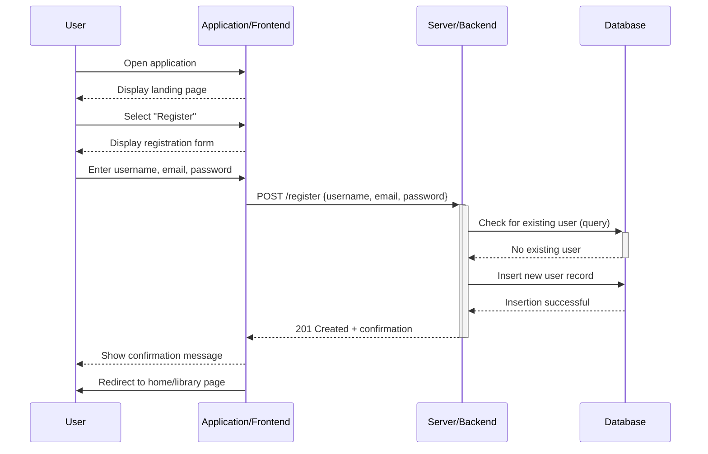
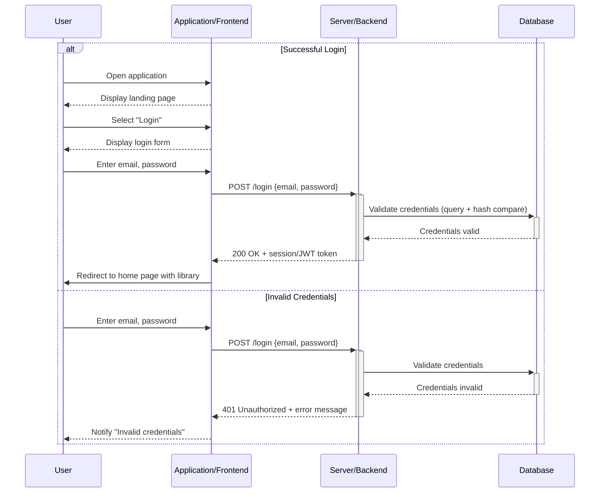
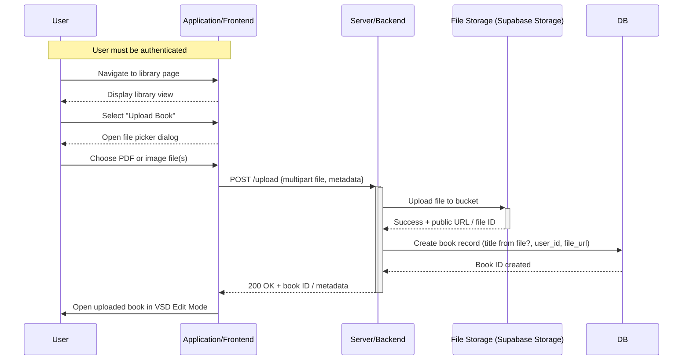
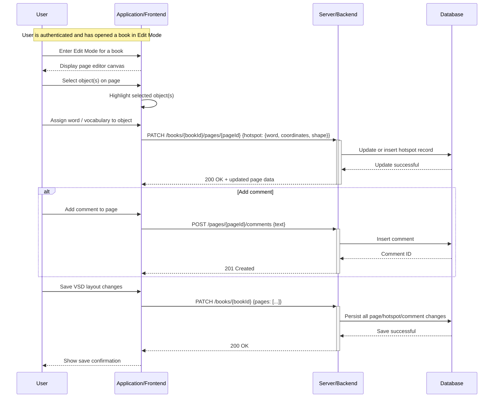
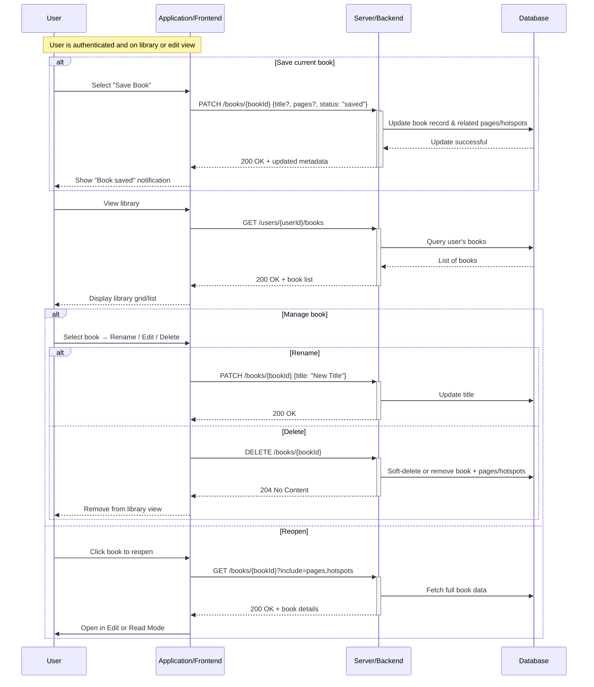
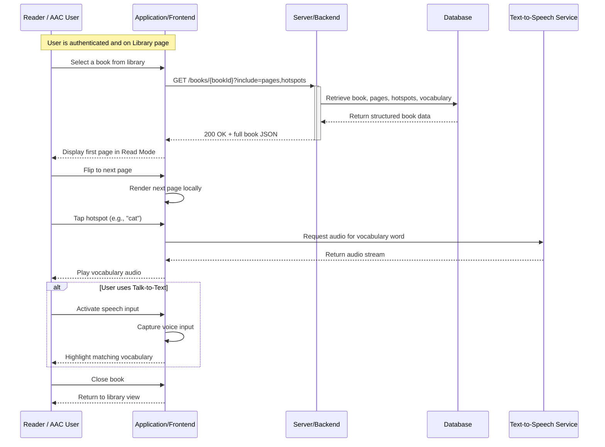
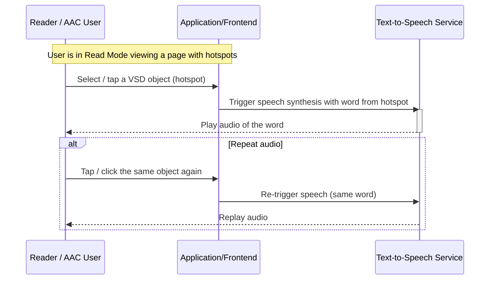
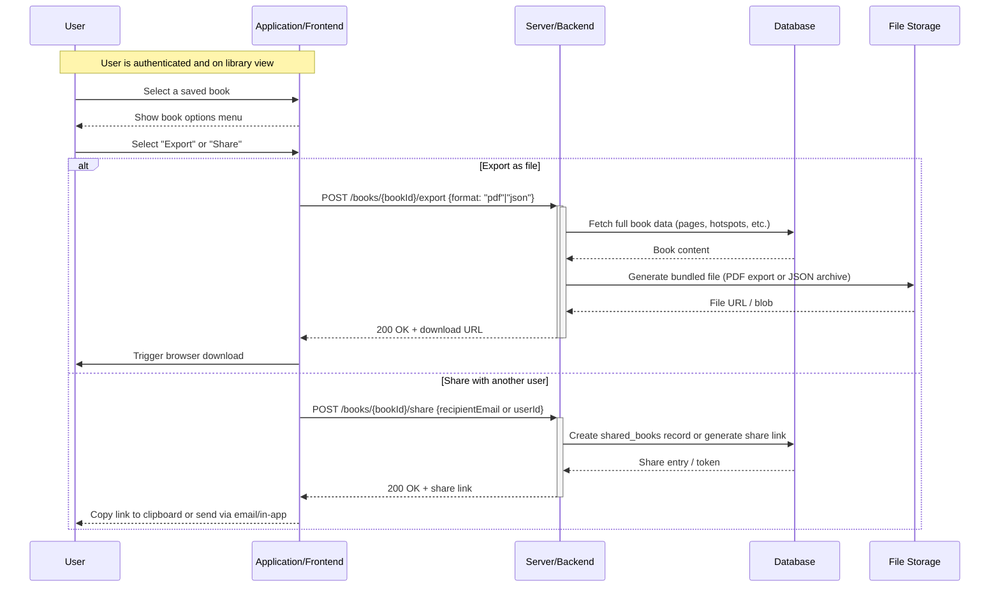
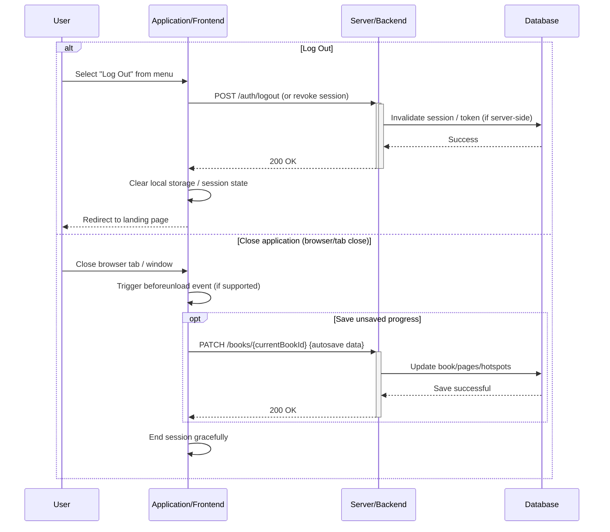

# Use Case Diagrams

Sequence diagrams showing the data flow for all use cases. One sequence diagram corresponds to one use case and different use cases should have different corresponding sequence diagrams.

---

## Use Case 1 – Account Creation (User / Caretaker)

**Goal**: As a user, I want to create an account so I can save and manage my storybooks.

---
## Use Case 2 – Signing In (User / Caretaker)

**Goal**: As a user, I want to log into my account so I can access my saved storybooks.

---
## Use Case 3 – Uploading Book (User / Caretaker)

**Goal**: As a user, I want to upload a book so I can create a VSD storybook.

---
## Use Case 4 – Edit VSD Pages (User / Caretaker)

**Goal**: As a user, I want to add interactive vocabulary to the pages.

---
## Use Case 5 – Save and Manage Storybook Library (User / Caretaker)

**Goal**: As a user, I want to save and reopen books so I can edit them later.

---
## Use Case 6 – Pick and Read a Book (Reader / AAC User)

**Goal**: As a user, I want to be able to pick and read a book from my library.

---
## Use Case 7 – Play Text-To-Speech Audio (Reader / AAC User)

**Goal**: As a reader, I want to hear the words read out loud.

---

## Use Case 8 – Export and Share Books (User / Caretaker)

**Goal**: As a user, I want to share and export my storybooks.

---
## Use Case 9 – Close Application (User)

**Goal**: As a user, I want to log out or exit the application.

---
